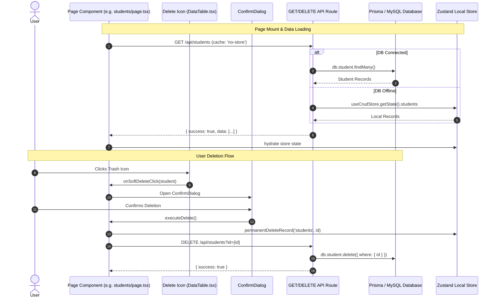

# Page Components & Architecture Reference — School AIOS (ERP)

---

## 1. Page Components Explanation

### 🔐 Authentication Pages (`src/app/(auth)`)

| Page Route | Component File | Description & Functionality |
| :--- | :--- | :--- |
| `/login` | `login/page.tsx` | Admin & Staff login screen with credential validation, role selection, and session initiation via `useAuthStore`. |
| `/forgot-password` | `forgot-password/page.tsx` | Password recovery initial step requesting user email to trigger verification code generation. |
| `/otp-verification` | `otp-verification/page.tsx` | 6-digit OTP verification interface for secure multi-factor authentication. |
| `/reset-password` | `reset-password/page.tsx` | Final password reset form for setting a new account password. |

---

### 📊 Dashboard & Operational Pages (`src/app/(dashboard)`)

| Page Route | Component File | Description & Functionality |
| :--- | :--- | :--- |
| `/` | `page.tsx` | Executive Dashboard featuring key KPI cards (Total Students, Staff, Revenue, Pending Fees), charts, and quick-action shortcuts. |
| `/students` | `students/page.tsx` | Master Student Management. Handles student directory listing, admission registration, class filtering, student profile drawer, Excel import/export, soft delete & permanent delete. |
| `/staff` | `staff/page.tsx` | Staff & Teacher Directory. Manages teacher onboarding, department allocation, contact details, qualification records, and status updates. |
| `/staff/allocation` | `staff/allocation/page.tsx` | Class Teacher & Transport allocation matrix for assigning staff to classes and bus routes. |
| `/attendance` | `attendance/page.tsx` | Daily Attendance Marking portal for students and staff with bulk marking, absent/late status logging, and monthly percentage tracking. |
| `/fees` | `fees/page.tsx` | Student Fee Management. Fee collection, structure definition (Tuition, Transport, Hostel), payment history, invoice generation, and pending fee alerts. |
| `/finance` | `finance/page.tsx` | General Ledger & Financial Vouchers. Manages Income/Expense vouchers, account transactions, cash/bank ledgers, and dynamic financial summaries. |
| `/examinations` | `examinations/page.tsx` | Examination scheduler, subject-wise mark entry, grade card generation, and rank calculation. |
| `/purchases` | `purchases/page.tsx` | Vendor Purchase Orders. Tracks item procurement, order status, purchase invoices, and vendor balance updates. |
| `/sales` | `sales/page.tsx` | School Store & Uniform/Book Sales. Point-of-sale voucher creation, itemized billing, and daily sales collection reports. |
| `/inventory` | `inventory/page.tsx` | Stock & Inventory Control. Tracks stock items, quantity in hand, low-stock threshold alerts, and asset categories. |
| `/bus` | `bus/page.tsx` | Transport & Bus Route Management. Route creation, bus driver assignment, vehicle maintenance, and student bus pass tracking. |
| `/announcements` | `announcements/page.tsx` | Circulars & Notice Board. Publish announcements targeted to Students, Staff, or Parents with priority tags. |
| `/notifications` | `notifications/page.tsx` | System Notification Feed for activity alerts, audit events, and critical system warnings. |
| `/suppliers` | `suppliers/page.tsx` | Vendor & Supplier Directory. Supplier contact info, payment terms, and ledger history. |
| `/reports` | `reports/page.tsx` | Analytics & PDF/Excel Export Hub for printing academic, attendance, inventory, and financial statements. |
| `/settings` | `settings/page.tsx` | System Configuration. School profile, financial accounts setup, user roles, permission matrix, and **Reset Demo Seed Data** tool. |
| `/admin` | `admin/page.tsx` | Super Admin panel for system maintenance, user audit logs, and global database monitoring. |
| `/profile` | `profile/page.tsx` | Logged-in User Profile settings, password change, and security credentials update. |

---

## 2. Delete Handler Used by Delete Icon

The delete action is triggered from the `DataTable.tsx` component delete icon (`<Trash2 />`). It delegates the delete action to the page component via state and a confirmation dialog (`ConfirmDialog.tsx`).

### Step 1: UI Trigger inside `DataTable.tsx`
```tsx
{/* Delete Icon Button inside Table Action Column */}
<button
  onClick={() => onSoftDeleteClick(item)}
  className="p-1.5 rounded-lg text-slate-400 hover:text-rose-600 hover:bg-rose-50 transition-colors"
  title="Move to Trash"
>
  <Trash2 className="w-4 h-4" />
</button>
```

### Step 2: Page Component Delete Handler (`students/page.tsx`)
```tsx
// 1. State holding the selected record for deletion
const [confirmDelete, setConfirmDelete] = useState<{ id: string; name: string; permanent: boolean } | null>(null);

// 2. Action handler passed to DataTable
const handleSoftDelete = (student: Student) => {
  setConfirmDelete({ id: student.id, name: student.name, permanent: false });
};

const handlePermanentDelete = (student: Student) => {
  setConfirmDelete({ id: student.id, name: student.name, permanent: true });
};

// 3. Execution on ConfirmDialog approval
const executeDelete = async () => {
  if (!confirmDelete) return;

  if (confirmDelete.permanent) {
    // Local Zustand store update
    permanentDeleteRecord('students', confirmDelete.id);

    // API DELETE request to server/database
    try {
      await fetch(`/api/students?id=${confirmDelete.id}`, { method: 'DELETE' });
      router.refresh();
    } catch (err) {
      console.error('Failed to delete student from DB:', err);
    }
  } else {
    // Soft Delete (move to trash flag)
    softDeleteRecord('students', confirmDelete.id);
  }

  setConfirmDelete(null);
};
```

---

## 3. The GET API Route Implementation (`src/app/api/students/route.ts`)

The GET API follows a **hybrid data source model**. It queries the MySQL database via Prisma if connected; otherwise, it falls back to serving state from the Zustand store.

```typescript
import { NextResponse } from 'next/server';
import { db, isDbConnected } from '@/lib/db';
import { useCrudStore } from '@/store/crud-store';

export const dynamic = 'force-dynamic';

export async function GET() {
  try {
    // 1. Primary: If MySQL Database is connected, fetch via Prisma
    if (isDbConnected()) {
      const dbStudents = await db.student.findMany({
        orderBy: { createdAt: 'desc' },
      });

      const mappedStudents = dbStudents.map((s) => ({
        ...s,
        status: s.status === 'ACTIVE' || s.status === 'Active' ? 'Active' : 'Transferred',
      }));

      return NextResponse.json({ success: true, data: mappedStudents });
    }
  } catch (err) {
    console.error('Database query error (students):', err);
  }

  // 2. Fallback: If DB is offline, return local Zustand store memory state
  try {
    const store = useCrudStore.getState();
    return NextResponse.json({ success: true, data: store?.students || [] });
  } catch (storeErr) {
    return NextResponse.json({ success: true, data: [] });
  }
}
```

---

## 4. The Page That Loads The Data (`src/app/(dashboard)/students/page.tsx`)

Every management page loads its data on component mounting using React's `useEffect` hook. It calls the GET API endpoint with `{ cache: 'no-store' }` to bypass stale browser cache and updates the global Zustand store.

```tsx
'use client';

import React, { useEffect, useState } from 'react';
import { useCrudStore } from '@/store/crud-store';
import DataTable from '@/components/crud/DataTable';

export default function StudentsPage() {
  const { students } = useCrudStore();

  // Page Load Data Fetcher
  useEffect(() => {
    fetch('/api/students', { cache: 'no-store' })
      .then((res) => res.json())
      .then((res) => {
        if (res.success && Array.isArray(res.data) && res.data.length > 0) {
          // Hydrate Zustand store with latest data from DB
          useCrudStore.setState({ students: res.data });
        }
      })
      .catch((err) => console.error('Failed to load students from DB:', err));
  }, []);

  return (
    <div className="p-6 space-y-6">
      <h1 className="text-2xl font-bold">Student Directory</h1>

      {/* Render Data Table with hydrated state */}
      <DataTable
        data={students}
        columns={studentColumns}
        onSoftDeleteClick={(student) => setConfirmDelete({ id: student.id, name: student.name, permanent: false })}
        onPermanentDeleteClick={(student) => setConfirmDelete({ id: student.id, name: student.name, permanent: true })}
      />
    </div>
  );
}
```

---

## Data Flow Lifecycle Summary


