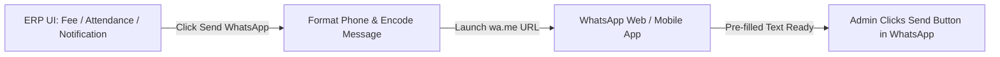

# 📱 Free SMS & WhatsApp Integration Guide (Click-to-Send Method)

## 📌 Overview
The **Free Method** allows the School ERP to send pre-formatted **WhatsApp messages** and **SMS alerts** directly to parents **without buying third-party API credits or paying gateway monthly fees**. 

It uses web protocol URI schemes (`https://wa.me/` and `sms:`) to open WhatsApp Web / App with pre-filled dynamic message content for one-click sending.

---

## ⚙️ How It Works (Working Mechanism)



1. Admin clicks **"Send WhatsApp"** or **"Send SMS"** button next to a student record.
2. ERP dynamically formats the parent's phone number and URL-encodes the message template (e.g., student name, pending fee, receipt link).
3. Browser automatically opens WhatsApp (Desktop or Mobile App) with the message pre-typed.
4. Admin reviews and clicks **Send** in 1 second.

---

## 🛠️ Step-by-Step Implementation Process

### Step 1: Phone Number & Message Encoder Helper
Create a utility function to sanitize phone numbers and build WhatsApp URLs.

```typescript
// src/lib/whatsapp-utils.ts

export const buildWhatsAppUrl = (phone: string, message: string): string => {
  // Clean phone number (strip spaces, dashes, keep country code e.g. 91)
  let cleanPhone = phone.replace(/\D/g, '');
  if (cleanPhone.length === 10) {
    cleanPhone = `91${cleanPhone}`; // Default to India (+91)
  }

  const encodedMsg = encodeURIComponent(message);
  return `https://wa.me/${cleanPhone}?text=${encodedMsg}`;
};

export const buildSmsUrl = (phone: string, message: string): string => {
  let cleanPhone = phone.replace(/\D/g, '');
  const encodedMsg = encodeURIComponent(message);
  return `sms:${cleanPhone}?body=${encodedMsg}`;
};
```

---

### Step 2: Message Template Generators

Define reusable message templates for different modules:

```typescript
// Templates for Fee, Attendance, and Notifications

export const getFeeReminderMessage = (studentName: string, className: string, dueAmount: number) => {
  return `Dear Parent,\n\nThis is a gentle reminder regarding the fee payment for *${studentName}* (${className}).\n\nPending Due Amount: *₹${dueAmount.toLocaleString('en-IN')}*\n\nKindly clear the dues at your earliest convenience.\n\nRegards,\n*ABS School Accounts Office*`;
};

export const getAbsentAlertMessage = (studentName: string, className: string, date: string) => {
  return `Dear Parent,\n\nYour ward *${studentName}* (${className}) has been marked *ABSENT* today (${date}).\n\nIf this was uninformed, please contact the class teacher immediately.\n\nRegards,\n*ABS School Administration*`;
};
```

---

### Step 3: Integrate UI Button Component

Add the **Send WhatsApp** button to Fee Management, Attendance, or Notifications pages:

```tsx
import { MessageSquare } from 'lucide-react';
import { buildWhatsAppUrl, getFeeReminderMessage } from '@/lib/whatsapp-utils';

export function WhatsAppButton({ parentPhone, studentName, className, dueAmount }: any) {
  const handleSend = () => {
    const message = getFeeReminderMessage(studentName, className, dueAmount);
    const whatsappUrl = buildWhatsAppUrl(parentPhone, message);
    window.open(whatsappUrl, '_blank');
  };

  return (
    <button
      onClick={handleSend}
      className="px-3 py-1.5 rounded-xl bg-emerald-600 hover:bg-emerald-500 text-white font-bold text-xs flex items-center gap-1.5 shadow-xs transition-all active:scale-95"
    >
      <MessageSquare className="w-4 h-4" /> Send WhatsApp
    </button>
  );
}
```

---

## 📊 Comparison: Pros & Cons

| Advantages (Pros) | Limitations (Cons) |
| :--- | :--- |
| ✅ **100% Free** (No API credit cost) | ⚠️ Requires 1-click manual action by admin |
| ✅ **Zero Setup Delay** (No DLT registration) | ⚠️ Cannot auto-send 1000 messages in background at once |
| ✅ **100% Delivery Rate** (Direct to WhatsApp) | ⚠️ Dependent on admin having WhatsApp Web/App open |
| ✅ **Rich Formatting** (Bold, italics, emojis, links) | |

---

## 🎯 Summary
The **Free Click-to-Send Method** is ideal for schools wanting **zero recurring costs** while maintaining direct communication with parents for fee reminders, attendance alerts, and circulars.
