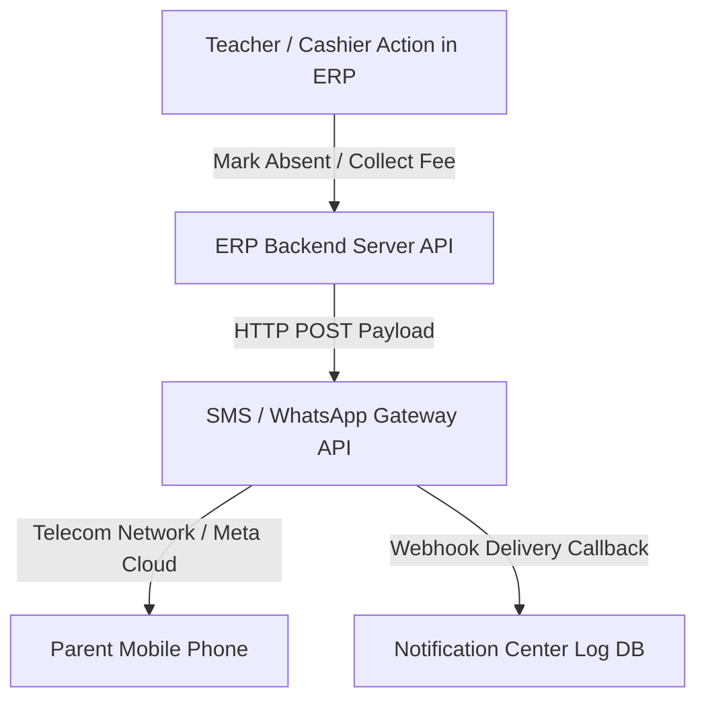

# 🌐 Paid Automated SMS & WhatsApp Gateway Integration Guide

## 📌 Overview
The **Paid Automated Method** enables 100% background, hands-free sending of **SMS and WhatsApp messages** to parents using third-party API Gateways (e.g., **Fast2SMS, MSG91, Twilio, Meta WhatsApp Cloud API, Interakt**).

When an action happens in the ERP (e.g. marking attendance absent or collecting fees), the server automatically calls the Gateway API in the background without requiring any manual clicks.

---

## ⚙️ How It Works (Automated Architecture)



1. **Trigger Action**: Staff marks student absent or collects fee payment.
2. **Server Background Execution**: Next.js API route formats message & sends HTTP POST request to gateway API.
3. **Delivery**: Gateway delivers SMS / WhatsApp message to parent's phone instantly.
4. **Log & Tracking**: Delivery status (`Sent`, `Delivered`, `Failed`) is recorded in ERP **Notification Center**.

---

## 🛠️ Step-by-Step Implementation Process

### Step 1: Obtain Provider API Credentials
Register with an approved SMS/WhatsApp gateway provider (e.g., MSG91, Fast2SMS, Twilio, or Meta) and obtain:
- **API Key** / Auth Token
- **Sender ID** (e.g. `ABSSCH`)
- **DLT Template ID** (Required for Indian TRAI regulations)

---

### Step 2: Configure Environment Variables
Add gateway credentials to `.env`:

```env
# SMS Gateway Config (Fast2SMS / MSG91)
SMS_GATEWAY_API_KEY="your_fast2sms_or_msg91_api_key"
SMS_SENDER_ID="ABSSCH"

# WhatsApp Business API Config (Twilio / Meta Cloud API)
WHATSAPP_API_URL="https://graph.facebook.com/v18.0/YOUR_PHONE_NUMBER_ID/messages"
WHATSAPP_BEARER_TOKEN="your_meta_whatsapp_access_token"
```

---

### Step 3: Server-Side SMS Service Implementation

Create a backend API service handler:

```typescript
// src/lib/sms-service.ts

export interface SendSmsParams {
  toPhone: string;
  message: string;
  templateId?: string;
}

export async function sendAutomatedSms({ toPhone, message, templateId }: SendSmsParams) {
  try {
    const apiKey = process.env.SMS_GATEWAY_API_KEY;
    if (!apiKey) {
      console.warn('SMS API Key missing. Skipping real SMS dispatch.');
      return { success: false, reason: 'API Key not configured' };
    }

    const cleanPhone = toPhone.replace(/\D/g, '').slice(-10); // 10-digit mobile

    // Example call using Fast2SMS API
    const response = await fetch('https://www.fast2sms.com/dev/bulkV2', {
      method: 'POST',
      headers: {
        authorization: apiKey,
        'Content-Type': 'application/json',
      },
      body: JSON.stringify({
        route: 'dlt',
        sender_id: process.env.SMS_SENDER_ID || 'ABSSCH',
        message: templateId, // DLT Template ID
        variables_values: message,
        numbers: cleanPhone,
      }),
    });

    const data = await response.json();
    return { success: data.return === true, data };
  } catch (error) {
    console.error('Failed to send automated SMS:', error);
    return { success: false, error };
  }
}
```

---

### Step 4: Server-Side WhatsApp Cloud API Implementation

```typescript
// src/lib/whatsapp-service.ts

export async function sendAutomatedWhatsApp(toPhone: string, templateName: string, parameters: string[]) {
  try {
    const token = process.env.WHATSAPP_BEARER_TOKEN;
    const url = process.env.WHATSAPP_API_URL;
    if (!token || !url) return { success: false, reason: 'WhatsApp API credentials missing' };

    let cleanPhone = toPhone.replace(/\D/g, '');
    if (cleanPhone.length === 10) cleanPhone = `91${cleanPhone}`;

    const response = await fetch(url, {
      method: 'POST',
      headers: {
        Authorization: `Bearer ${token}`,
        'Content-Type': 'application/json',
      },
      body: JSON.stringify({
        messaging_product: 'whatsapp',
        to: cleanPhone,
        type: 'template',
        template: {
          name: templateName,
          language: { code: 'en' },
          components: [
            {
              type: 'body',
              parameters: parameters.map((val) => ({ type: 'text', text: val })),
            },
          ],
        },
      }),
    });

    const data = await response.json();
    return { success: response.ok, data };
  } catch (err) {
    return { success: false, error: err };
  }
}
```

---

### Step 5: Trigger Automatically on ERP Events

#### Example: Auto-Dispatch on Attendance Marking
In `src/app/api/attendance/route.ts`:

```typescript
// Inside Attendance Submit Route handler
if (status === 'Absent') {
  // Fire background SMS/WhatsApp alert asynchronously
  sendAutomatedSms({
    toPhone: student.parentPhone,
    message: `Your ward ${student.name} is absent today.`,
    templateId: 'DLT_ABSENT_TEMPLATE_1002',
  });

  // Log in Notification Center DB
  await db.systemNotification.create({
    data: {
      title: `Absent Alert: ${student.name}`,
      message: `Automated SMS dispatched to ${student.parentPhone}`,
      type: 'warning',
      category: 'Attendance',
    },
  });
}
```

---

## 📊 Comparison: Pros & Cons

| Advantages (Pros) | Considerations (Cons) |
| :--- | :--- |
| ✅ **100% Automated** (Zero staff manual effort) | 💳 Requires purchasing API credits (approx. ₹0.15 - ₹0.40 per msg) |
| ✅ **Bulk Dispatch** (Send to 1,000+ parents instantly) | 📜 Requires TRAI DLT registration (India SMS regulation) |
| ✅ **Instant Delivery Logs** (Track Sent / Delivered / Failed) | 🔑 Requires setting up Meta WhatsApp Business Account |
| ✅ **Background Execution** (Runs even when admin logged out) | |

---

## 🎯 Summary
The **Paid Automated Gateway Integration** is best suited for medium to large schools requiring **hands-free automated operations** for attendance alerts, fee collection receipts, and exam results dispatch.
